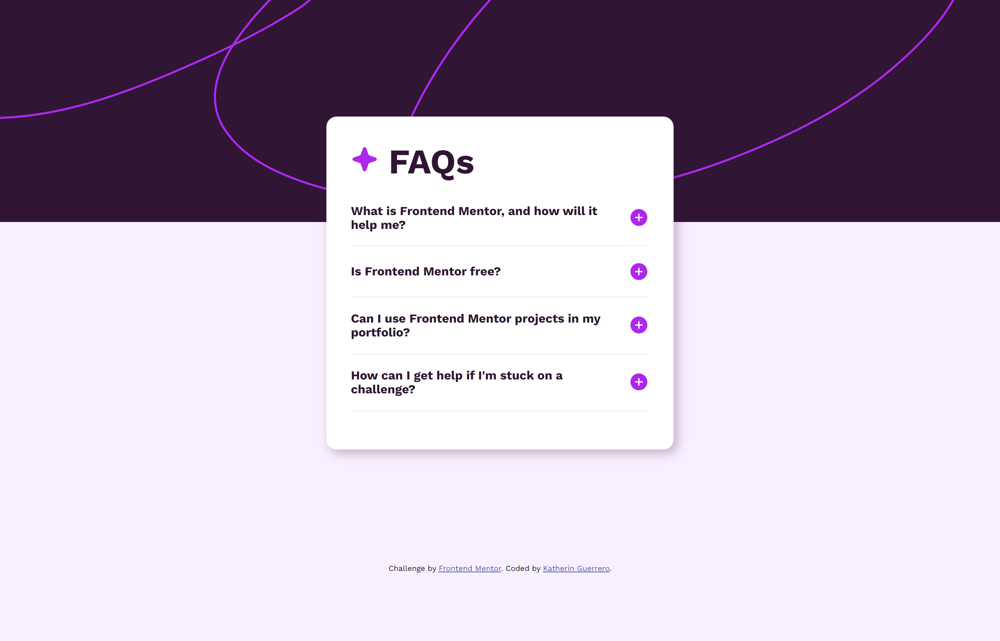

# Frontend Mentor - FAQ accordion solution

This is a solution to the [FAQ accordion challenge on Frontend Mentor](https://www.frontendmentor.io/challenges/faq-accordion-wyfFdeBwBz). Frontend Mentor challenges help you improve your coding skills by building realistic projects. 

## Table of contents

- [Overview](#overview)
  - [The challenge](#the-challenge)
  - [Screenshot](#screenshot)
  - [Links](#links)
- [My process](#my-process)
  - [Built with](#built-with)
  - [Continued development](#continued-development)
- [Author](#author)
## Overview

### The challenge

Users should be able to:

- Hide/Show the answer to a question when the question is clicked
- Navigate the questions and hide/show answers using keyboard navigation alone
- View the optimal layout for the interface depending on their device's screen size
- See hover and focus states for all interactive elements on the page

### Screenshot

### Links

- Solution URL: [Add solution URL here](https://your-solution-url.com)
- Live Site URL: [Add live site URL here](https://your-live-site-url.com)

## My process

### Built with

- Semantic HTML5 markup
- CSS custom properties
- Javascript
### What I learned
I had never created a component like this before, and I thoroughly enjoyed the challenge. I was able to implement the `toggle` functionality in the attributes and play around with it in the code.

### Continued development

I will continue practicing HTML semantics, best practices. I also want to delve into challenges that test my CSS skills. I have practiced a lot of Javascript, I think it’s time to practice a little design to be a good Frontend developer.

## Author

- Website - [Kathe Guerrero](https://sarkastherin.github.io/my-portfolio/)
- Frontend Mentor - [@sarkastherin](https://www.frontendmentor.io/profile/Sarkastherin)
- Twitter - [@sarkastherin](https://www.twitter.com/sarkastherin)

